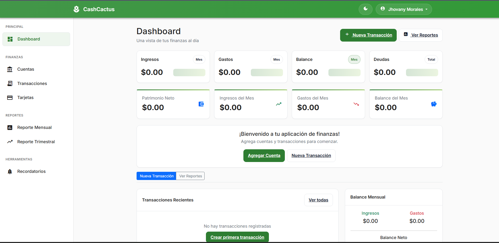

# CashCactus (Personal Finance) [](https://sonarcloud.io/summary/new_code?id=brunojhovany_CashCactus)



Open-source Flask application to manage personal finances: accounts, credit cards, debts, transactions, reminders, and reports.

## Features
- Accounts (checking, savings, investment) with balances
- Credit cards and debt tracking
- Transactions with categories and transfers
- Reports: monthly, quarterly, annual; charts with trends
- Reminders for credit card payments
- Dark mode and modern UI

## Requirements
- Python 3.8+
- SQLite (default) or any SQLAlchemy-supported DB

## Quick start
```fish
# Create virtual environment (fish shell)
python -m venv .venv
source .venv/bin/activate.fish
pip install --upgrade pip
pip install -r requirements.txt

# Run the app
export FLASK_APP=run.py
export SECRET_KEY=change-me
python run.py
```

Open http://localhost:5000.

## Configuration
All configuration via environment variables (`.env` or deployment env). See `config.py` and `.env.example`.

Core:
- SECRET_KEY: required; stable for session signing.
- DATABASE_URL: SQLAlchemy URL (defaults to local SQLite).
- TIMEZONE: affects scheduler cron times (default UTC).
- SESSION_HOURS, REMEMBER_DAYS: session persistence.

Security / Proxy:
- SESSION_COOKIE_SECURE / FORCE_COOKIE_SECURE
- FORCE_HTTPS (adjust URL generation behind TLS proxy)

Closed Beta:
- BETA_MODE=1 enables restriction.
- BETA_ALLOWED_EMAILS (comma list) and/or BETA_ALLOWED_DOMAIN.

Google OAuth:
- GOOGLE_CLIENT_ID / GOOGLE_CLIENT_SECRET (from Google Cloud Console)
- GOOGLE_REDIRECT_PATH (default /auth/google/callback)

Other:
- REPORT_FREQUENCY_DAYS, REMINDER_ADVANCE_DAYS

For local development: copy `.env.example` to `.env` and edit.

## Daily jobs
APScheduler runs in-process:
- 03:00 Daily maintenance (update balances, auto interest entries)
- 09:00 Update credit card reminders

## Development
- Run tests: `pytest`
- Linting/formatting: (optional) black/ruff

## License
MIT — see `LICENSE`.
